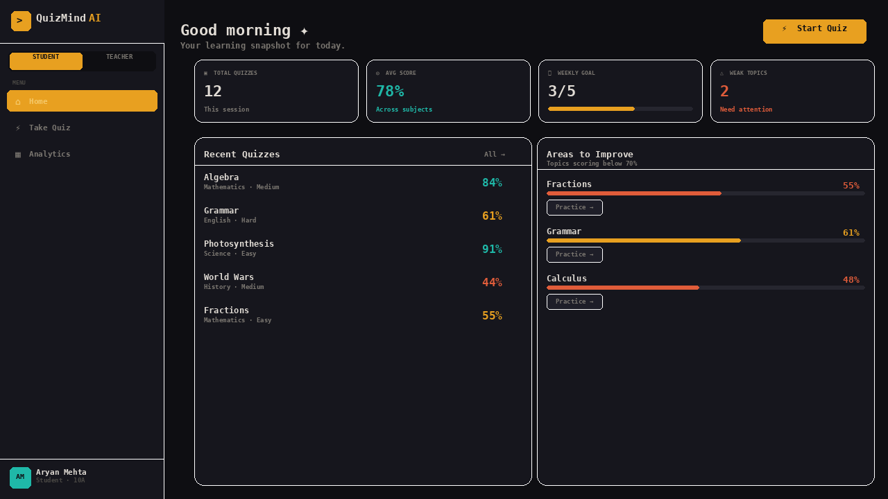
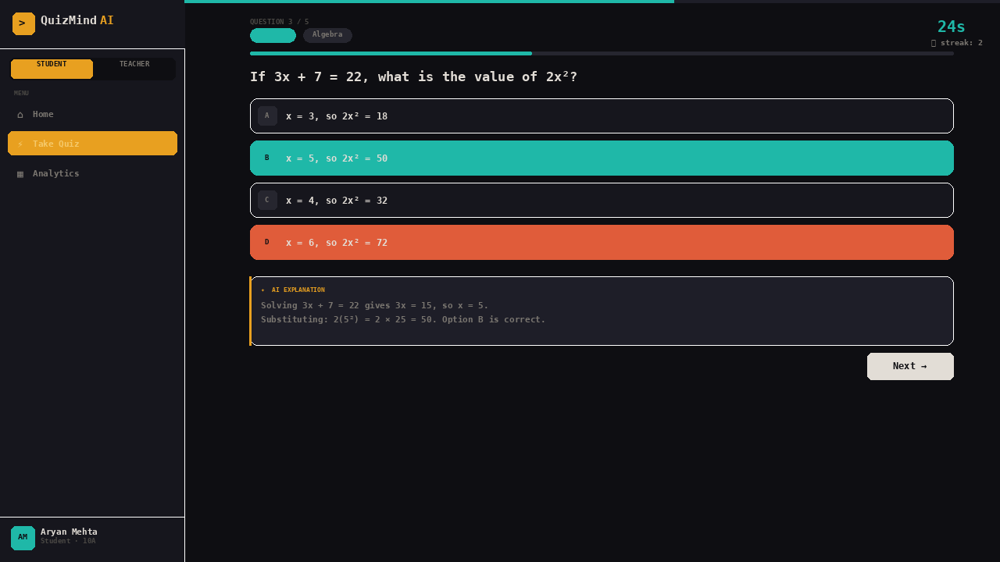
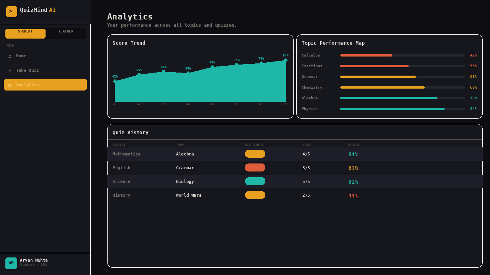
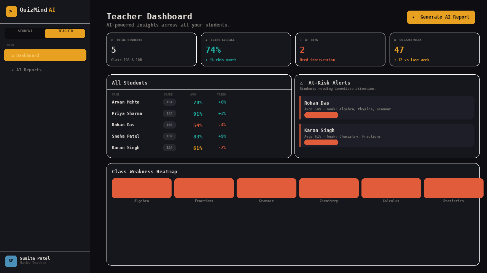
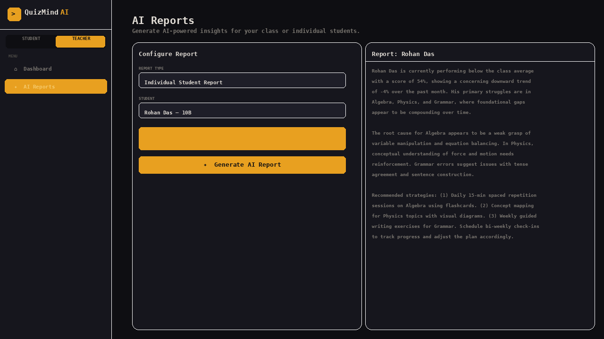

# QuizMind AI

An AI-powered quiz and performance analytics platform for students and educators. Built with React and the Anthropic Claude API, following a strict **MVP (Model-View-Presenter)** architecture across 19 separate files.

---

## Screenshots

### Student Home Dashboard



### Quiz Playing Screen — Adaptive Difficulty + Timer



### Analytics — Score Trend + Topic Performance Map



### Teacher Dashboard — Class Insights + At-Risk Alerts



### AI Reports — Claude-Generated Student Reports



---

## Features

**For Students**

- AI-generated quizzes on any subject and topic via the Claude API
- Adaptive difficulty — questions get harder as you build a correct-answer streak
- Per-question countdown timer with color-coded urgency indicator
- Live AI explanations after every answer, generated by Claude
- Personal analytics dashboard with score trend sparkline and topic performance map
- Weak topic detection with one-click practice shortcuts
- Full quiz history table with subject, difficulty, and result breakdown

**For Teachers**

- Class-level dashboard showing all student averages and trend directions
- At-risk student alerts with weak topic breakdowns
- Class weakness heatmap showing how many students struggle per topic
- AI report generator — produces full-prose class or individual student reports using Claude, with intervention recommendations and study strategy guidance

---

## Architecture — MVP Pattern

The codebase is split into four layers with strict separation of concerns. Views never call the API. The model layer has no React imports. Presenters are the only layer that bridges the two.

```
quizmind/
│
├── model/                          # Pure logic, no React
│   ├── constants.js                # Subjects, topics, difficulty levels, sample data
│   ├── sessionStore.js             # In-memory state: quiz history, topic scores
│   └── apiService.js               # All Claude API calls (quiz gen, explanations, reports)
│
├── view/                           # Pure UI, no business logic, props only
│   ├── Sidebar.jsx                 # Navigation sidebar
│   ├── primitives.jsx              # Toast, Spinner, StatCard, ProgressBar, ScoreSparkline, etc.
│   ├── StudentHomeView.jsx         # Student dashboard screen
│   ├── QuizView.jsx                # Setup / playing / result screens
│   ├── AnalyticsView.jsx           # Analytics screen
│   ├── TeacherHomeView.jsx         # Teacher dashboard screen
│   └── ReportsView.jsx             # AI reports screen
│
├── presenter/                      # Bridges model ↔ view, owns feature state
│   ├── StudentHomePresenter.jsx    # Reads store, computes stats, passes to StudentHomeView
│   ├── QuizPresenter.jsx           # Owns quiz state machine, calls API, records results
│   ├── AnalyticsPresenter.jsx      # Transforms store data for charts
│   ├── TeacherHomePresenter.jsx    # Derives class metrics from student data
│   └── ReportsPresenter.jsx        # Manages report state, calls apiGenerateReport()
│
├── styles/
│   ├── global.css                  # Design tokens, reset, keyframes, Iosevka Charon Mono
│   └── components.css              # All component styles
│
└── main.jsx                        # Root router — renders Sidebar + correct Presenter
```

**MVP rules enforced throughout:**

| Layer     | Can it call the API? | Can it touch the store? | Can it render JSX?      |
| --------- | -------------------- | ----------------------- | ----------------------- |
| Model     | Yes                  | Yes                     | No                      |
| View      | No                   | No                      | Yes                     |
| Presenter | Yes (via model)      | Yes (via model)         | Yes (delegates to view) |

---

## Tech Stack

| Concern      | Technology                                              |
| ------------ | ------------------------------------------------------- |
| UI framework | React 18 (hooks)                                        |
| AI backend   | Anthropic Claude API (`claude-sonnet-4-20250514`)       |
| Font         | Iosevka Charon Mono (Google Fonts)                      |
| Styling      | Plain CSS with custom properties                        |
| Charts       | Hand-drawn SVG (no chart library dependency)            |
| State        | React `useState` / `useRef` (no external state manager) |
| Bundler      | Vite (recommended) or Create React App                  |

---

## Getting Started

### Prerequisites

- Node.js 18 or higher
- **Option A (Recommended):** Ollama (FREE, local) — download at [ollama.ai](https://ollama.ai)
- **Option B:** Anthropic API key (Paid) — get one at [console.anthropic.com](https://console.anthropic.com)

### Installation

```bash
git clone https://github.com/YOUR_USERNAME/quizmind-ai.git
cd quizmind-ai
npm install
```

### Option A: Using Ollama (FREE ✅ Recommended for Testing)

**1. Install Ollama**

- Download from [ollama.ai](https://ollama.ai)
- Install and restart your computer

**2. Create `.env` file:**

```env
AI_PROVIDER=ollama
OLLAMA_ENDPOINT=http://localhost:11434
```

**3. Start Ollama (in a terminal):**

```bash
ollama serve
```

**4. Download a model (in another terminal):**

```bash
ollama pull mistral
```

**5. Start your app:**

```bash
npm run dev:full
```

This runs both the backend server and frontend dev server together.

👉 **See [OLLAMA_SETUP.md](./OLLAMA_SETUP.md) for detailed Ollama guide**

### Option B: Using Anthropic Claude API (Paid)

**1. Create `.env` file:**

```env
AI_PROVIDER=anthropic
VITE_ANTHROPIC_API_KEY=your_api_key_here
```

**2. Get an API key:**

- Go to [console.anthropic.com](https://console.anthropic.com)
- Create account and add payment method
- Generate API key

**3. Start your app:**

```bash
npm run dev:full
```

### Running the App

```bash
# Option 1: Run both servers together (recommended)
npm run dev:full

# Option 2: Run servers separately
# Terminal 1:
npm run server

# Terminal 2:
npm run dev
```

Open [http://localhost:5175](http://localhost:5175) in your browser.

### Building for Production

```bash
npm run build
```

---

## Project Setup (Vite)

If starting from scratch, scaffold a Vite React project and drop the source files in:

```bash
npm create vite@latest quizmind-ai -- --template react
cd quizmind-ai
npm install
```

Replace `src/` with the contents of this repository's `src/` folder. Then run:

```bash
npm run dev
```

---

## How the Quiz Engine Works

1. **Setup** — the user picks subject, topic, difficulty, number of questions, and time per question.
2. **Generation** — `QuizPresenter` calls `apiGenerateQuiz()` in `apiService.js`, which sends a structured prompt to Claude and parses the JSON response into an array of question objects.
3. **Playing** — each question renders with a live countdown timer. The presenter tracks a correct-answer streak.
4. **Adaptive difficulty** — after 3 consecutive correct answers, the displayed difficulty badge upgrades (Easy → Medium → Hard). After 3 consecutive wrong answers, it downgrades.
5. **Explanation** — after each answer, `apiGenerateExplanation()` sends the question and the student's chosen option to Claude and streams back a 2–3 sentence explanation.
6. **Result** — final score is recorded into `sessionStore.js`. The result screen shows a per-question breakdown with correct answers and any timeout events.

---

## How the AI Report Generator Works

The teacher selects either a full class report or an individual student report. `ReportsPresenter` calls `apiGenerateReport()` in `apiService.js` with the student data formatted as a structured prompt. Claude returns a flowing prose report (no markdown headers or bullet points) containing a performance summary, root cause analysis of weak areas, and personalised study strategy recommendations.

---

## Folder Conventions

- File names use **PascalCase** for React components and **camelCase** for plain JS modules.
- Each file exports exactly one primary symbol matching its filename.
- Presenters are the only components that import from both `model/` and `view/`.
- `main.jsx` is the only file that imports from `presenter/`.

---

## Customisation

**Adding a new subject or topic**
Edit `TOPICS` in `model/constants.js`. The subject and topic selectors in the quiz setup form are driven entirely from this object.

**Changing the AI model**
Update `CLAUDE_MODEL` in `model/constants.js`.

**Adjusting adaptive difficulty thresholds**
Change `ADAPTIVE_STREAK_THRESHOLD` in `model/constants.js`.

**Connecting a real student database**
Replace the functions in `model/sessionStore.js` with API calls to your backend. The presenter layer will not need any changes.

---

## Design System

All design tokens are defined as CSS custom properties in `styles/global.css`:

| Token         | Value                 | Usage                     |
| ------------- | --------------------- | ------------------------- |
| `--c-bg`      | `#0e0e12`             | App background            |
| `--c-surface` | `#16161d`             | Card backgrounds          |
| `--c-amber`   | `#e8a020`             | Primary accent, CTAs      |
| `--c-teal`    | `#1fb8a8`             | Success, correct answers  |
| `--c-coral`   | `#e05c3a`             | Error, at-risk indicators |
| `--font`      | `Iosevka Charon Mono` | All text                  |

---

## License

MIT — free to use, modify, and distribute.
